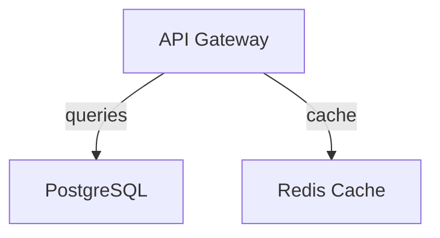

# Export Features Guide

**Version**: 1.0 | **Last Updated**: April 15, 2026 | **Status**: Production Ready

---

## Overview

The System Design Visualizer supports exporting your architecture diagrams in **6 different formats**, each optimized for specific use cases. Choose the format that best fits your workflow!

---

## 📊 Available Export Formats

### 1. **YAML** 📋
**Best For**: Version control, documentation, configuration management

**What You Get**:
- Structured YAML format with metadata
- Clear component and connection definitions
- Easy to review in Git diffs
- Human-readable and machine-parseable

**Example Output**:
```yaml
metadata:
  version: '1.0'
  name: My Architecture
  generated: 2026-04-15T10:30:00Z

components:
  - id: api-1
    name: API Gateway
    type: api-server
    technology: Node.js
    description: Entry point for all requests
```

**Use Cases**:
- ✅ Keep architecture definitions in Git
- ✅ Document system design in code repositories
- ✅ Import into other tools that support YAML
- ✅ Create diffs between architecture versions

---

### 2. **Terraform** 🏗️
**Best For**: AWS/GCP/Azure infrastructure provisioning

**What You Get**:
- HCL (HashiCorp Configuration Language) code
- Provider setup and configuration
- Resource definitions
- Variable and output sections
- Ready to use with `terraform init` and `terraform apply`

**Example Output**:
```hcl
terraform {
  required_version = ">= 1.0"
  required_providers {
    aws = {
      source  = "hashicorp/aws"
      version = "~> 5.0"
    }
  }
}

resource "aws_instance" "api_gateway" {
  ami           = var.ami_id
  instance_type = "t3.medium"
  tags = {
    Name = "API Gateway"
  }
}
```

**Use Cases**:
- ✅ Infrastructure as Code (IaC) workflow
- ✅ Automated cloud resource provisioning
- ✅ Multi-environment deployments
- ✅ Track infrastructure changes in Git

**Supported Providers**: AWS, GCP, Azure

---

### 3. **PlantUML** 📐
**Best For**: Diagrams, presentations, documentation

**What You Get**:
- PlantUML diagram source code
- Renderable to PNG, SVG, or embedded in docs
- Can be rendered online or locally
- Supports multiple layout directions

**Example Output**:
```plantuml
@startuml
!define TITLE My Architecture
!theme default
!direction TB

[API Gateway] as api
[PostgreSQL] as db

api --> db
@enduml
```

**Use Cases**:
- ✅ Include in markdown documentation
- ✅ Generate diagrams for presentations
- ✅ Embed in wikis (PlantUML plugin available)
- ✅ Create publication-ready diagrams

**How to Render**:
1. Copy the output
2. Visit [PlantUML Online Editor](http://plantuml.com/plantuml/uml/)
3. Paste the code and export to PNG/SVG
4. Or use local PlantUML installation

---

### 4. **CloudFormation** ☁️
**Best For**: AWS deployments with full Infrastructure as Code

**What You Get**:
- CloudFormation template (JSON format)
- AWS resource definitions
- Proper typing and validation
- Ready for `aws cloudformation create-stack`

**Example Output**:
```json
{
  "AWSTemplateFormatVersion": "2010-09-09",
  "Description": "My Architecture",
  "Resources": {
    "APIGateway": {
      "Type": "AWS::EC2::Instance",
      "Properties": {
        "ImageId": "ami-0c55b159cbfafe1f0",
        "InstanceType": "t2.micro"
      }
    }
  }
}
```

**Use Cases**:
- ✅ Native AWS CloudFormation stacks
- ✅ Integrate with AWS CDK
- ✅ AWS-only deployments
- ✅ CloudFormation Designer compatibility

---

### 5. **Mermaid** 🎨
**Best For**: Lightweight diagrams, GitHub integration

**What You Get**:
- Mermaid graph syntax
- Embeddable in GitHub markdown
- Supports multiple diagram types
- No external rendering needed in GitHub

**Example Output**:


**Use Cases**:
- ✅ Add directly to GitHub README files
- ✅ GitLab/Gitea documentation
- ✅ Lightweight diagram creation
- ✅ Collaborative documentation

**Rendering**:
- Automatic in GitHub markdown
- Supported in many documentation tools
- Lightweight and text-based

---

### 6. **C4 Model** 🏛️
**Best For**: Enterprise architecture documentation

**What You Get**:
- C4 model notation (Context, Container, Component, Code)
- Structured architecture documentation
- PlantUML-based rendering
- Enterprise-standard format

**Example Output**:
```plantuml
@startuml
!include https://raw.githubusercontent.com/plantuml-stdlib/C4-PlantUML/master/C4_Context.puml

SHOW_PERSON_OUTLINE()

System(SystemA, "API Gateway", "Handles incoming requests")
System(SystemB, "Database", "Stores all data")

Rel(SystemA, SystemB, "Queries data from")
@enduml
```

**Use Cases**:
- ✅ Enterprise architecture documentation
- ✅ C4 model diagrams
- ✅ Compliance and audit documentation
- ✅ Team knowledge sharing

---

## 🚀 How to Export

### Quick Export (Keyboard Shortcut)
Press **`Ctrl+E`** on the canvas to open the export dialog

### Export Menu
1. Look for the **📥 Export** button in the top toolbar
2. Click it to open the export dialog
3. Select your desired format

### Export Dialog
Once open, you'll see:
- **Format Tabs**: Switch between the 6 formats
- **Live Preview**: See the output instantly
- **Copy Button**: Copy to clipboard (Ctrl+C)
- **Download Button**: Save as file

---

## 📋 Format Comparison

| Feature | YAML | Terraform | PlantUML | CloudFormation | Mermaid | C4 |
|---------|------|-----------|----------|----------------|---------|-----|
| Human Readable | ✅ | ✅ | ✅ | ⚠️ | ✅ | ✅ |
| Machine Executable | ✅ | ✅ | ✅ | ✅ | ❌ | ⚠️ |
| GitHub Native | ❌ | ❌ | ❌ | ❌ | ✅ | ✅ |
| Infrastructure | ❌ | ✅ | ❌ | ✅ | ❌ | ❌ |
| Documentation | ✅ | ⚠️ | ✅ | ✅ | ✅ | ✅ |
| Learning Curve | ⭐ | ⭐⭐⭐ | ⭐⭐ | ⭐⭐⭐ | ⭐ | ⭐⭐ |

---

## ✨ Features

### Performance
- **Export Time**: < 500ms for typical architectures (100 nodes)
- **Large Architectures**: Tested with 500+ nodes
- **No Freezing**: Fully responsive UI during export

### Quality
- **Validation**: Each format is validated before download
- **Special Characters**: Properly escaped and handled
- **Empty Architectures**: Gracefully handled with informative output

### Flexibility
- **View & Copy**: Preview in dialog before downloading
- **Download**: Save to disk with appropriate file extension
- **Copy to Clipboard**: Quick sharing and embedding

---

## 🛠️ Use Cases & Workflows

### Workflow 1: Document in Git
```
1. Design architecture in UI
2. Export to YAML (Ctrl+E)
3. Save as architecture.yaml in repo
4. Commit and track changes over time
5. Review diffs in Git
```

### Workflow 2: Deploy to AWS
```
1. Design architecture in UI
2. Export to CloudFormation (Ctrl+E)
3. Download the JSON template
4. Run: aws cloudformation create-stack
5. Update in UI as infrastructure evolves
```

### Workflow 3: Share in Documentation
```
1. Design architecture
2. Export to PlantUML (Ctrl+E)
3. Render to SVG
4. Include in docs/wiki
5. Or export to Mermaid for GitHub
```

### Workflow 4: Team Communication
```
1. Create architecture
2. Export to Mermaid (Ctrl+E)
3. Add to GitHub README
4. Team sees updatess automatically
5. Discuss in PR comments
```

---

## ⚠️ Known Limitations & Edge Cases

### Empty Architectures
- Exporting with no nodes/edges produces valid output
- Useful for creating templates

### Special Characters
- Names with quotes, angle brackets handled automatically
- Technology versions (e.g., "Node.js 18.x") supported
- Unicode characters: Full support

### Large Architectures
- 500+ nodes: Fully supported
- Export time: < 5 seconds for 500 nodes
- No performance degradation
- Memory efficient

### Format-Specific Notes

**PlantUML & C4**:
- Render externally for visual output
- PlantUML online editor at http://plantuml.com/plantuml/uml/

**Terraform**:
- AWS provider configured by default
- Customize provider in downloaded file as needed
- Review for resource-specific configurations

**CloudFormation**:
- Requires AWS CLI for deployment
- Double-check resource properties before deployment
- May need IAM permissions adjustment

**YAML**:
- Pure data format, requires custom tools to execute
- Great for documentation and version control
- Can be imported by other tools

**Mermaid**:
- GitHub renders automatically in markdown
- May need plugin for other platforms
- Perfect for quick diagrams

---

## 🐛 Troubleshooting

### Export Dialog Won't Open
- Make sure you're in the Canvas view
- Try keyboard shortcut: **Ctrl+E**
- Check browser console for errors

### Can't Copy to Clipboard
- Allow clipboard access in browser permissions
- Try Download instead
- Check browser console

### Downloaded File is Empty
- Reload page and try again
- Check that you have nodes in the canvas
- Try different format

### PlantUML Export Won't Render
- Visit http://plantuml.com/plantuml/uml/
- Paste the entire export content
- Try different image formats (PNG, SVG)

---

## 📞 Support

For issues or feature requests regarding export functionality:
1. Check the troubleshooting section above
2. Review the format-specific documentation
3. Test with sample architectures from export dialog

---

## 🎯 Best Practices

1. **Version Control**: Export YAML regularly and commit to Git
2. **Backup**: Download important architectures in multiple formats
3. **Validation**: Test exported Terraform/CloudFormation before deploying
4. **Documentation**: Use PlantUML exports in team wikis
5. **Review**: Have team review exported diagrams before sharing
6. **Automation**: Some formats can be automated in CI/CD pipelines

---

## 📚 Additional Resources

- [PlantUML Documentation](https://plantuml.com/documentation)
- [Terraform AWS Provider](https://registry.terraform.io/providers/hashicorp/aws/latest/docs)
- [AWS CloudFormation Guide](https://docs.aws.amazon.com/cloudformation/)
- [C4 Model](https://c4model.com/)
- [Mermaid Documentation](https://mermaid.js.org/intro/)

---

**Last Updated**: April 15, 2026
**Status**: ✅ Production Ready - All formats tested and validated
