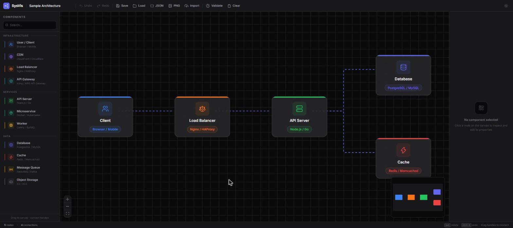

# System Design Visualizer

A drag-and-drop frontend tool for visually designing backend system architectures — like Figma, but for infrastructure. Place components such as load balancers, API servers, databases, caches, and message queues on a canvas, connect them, and document how a system fits together.



## Features

- **Drag-and-drop canvas** — place infrastructure components (User/Client, CDN, Load Balancer, API Gateway, API Server, Microservice, Worker, Database, Cache, Message Queue, Object Storage) and connect them with edges
- **Properties panel** — edit each component's name, description, technology, and config
- **Architecture validation** — flags disconnected nodes, invalid connections, and circular dependencies
- **Export** — save diagrams as JSON or PNG
- **Save / load projects** — persisted locally in the browser
- **Undo / redo** — full history for node and connection changes
- **Dark / light mode** — near-black + grey dark theme with persisted preference

## Tech Stack

- [Next.js](https://nextjs.org/) + TypeScript
- [React Flow](https://reactflow.dev/) for the canvas, nodes, and edges
- [Zustand](https://github.com/pmndrs/zustand) for state management
- [Tailwind CSS](https://tailwindcss.com/) for styling
- [Lucide](https://lucide.dev/) for icons

## Getting Started

```bash
npm install
npm run dev
```

Open [http://localhost:3000](http://localhost:3000) in your browser.

## Project Spec

A full write-up of the project idea, architecture, data model, and roadmap lives in [`main.md`](main.md).

## License

MIT
